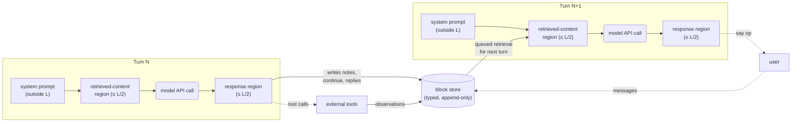
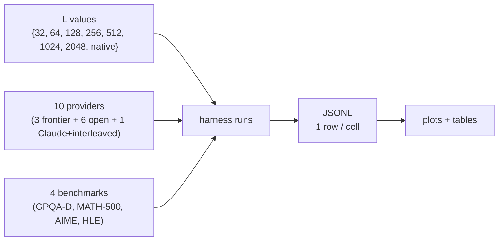
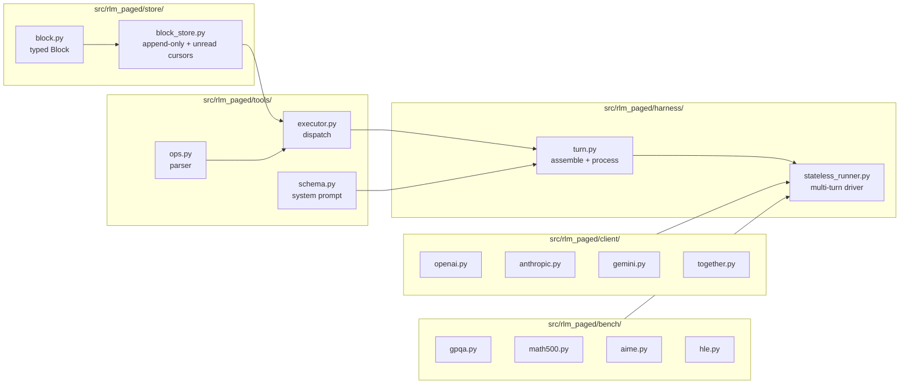
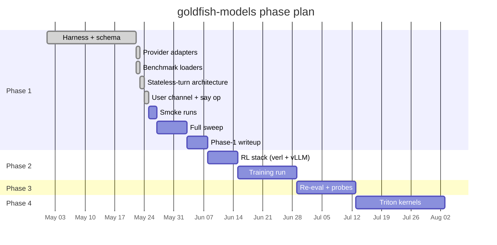

# goldfish-models

> **Language models with goldfish-sized working memory.**
>
> A provider-agnostic harness that confines an LLM's per-turn input and
> output to a hard token budget `L` (sweeping down to `L=32` — roughly
> Miller's 7 ± 2 chunks of human working memory), with all carried state
> deliberately externalized into a typed, append-only block store the
> model navigates via a small set of memory-management ops.

[]()
[]()
[]()
[]()

This README is the project's front-of-paper. For the canonical spec see
[**DESIGN.md**](DESIGN.md). For per-phase operational details, see the
[`docs/`](docs/) directory.

---

## Abstract

Frontier reasoning systems spend most of their compute on a single,
fragile resource: the active context window. The model decodes
auto-regressively into it, packs its chain of thought into it, and
re-derives prior conclusions whenever the trace falls off the front.
This is closer to writing on a blackboard until you run out of room than
to how durable problem-solving actually works in humans, where a small
working-memory buffer (≈ 4–7 chunks) operates above a large
deliberately-curated declarative store.

We propose **goldfish-models**: a stateless-turn architecture in which
each model turn is a single bounded process invocation reading from and
writing to a typed, append-only block store. The model's only state
between turns is what it explicitly externalized; everything else is
discarded. A hard cap `L` is enforced on each turn's input and output
(`L/2` each), and `L` is swept *down* from 2048 to 32 to study the
regime where the active window is too small to hold even a coherent
chain of thought. The architecture is provider-agnostic — the same
harness drives GPT-5, Claude, Gemini, DeepSeek-R1, Llama, and Qwen
without provider-specific code paths — and is the substrate for a
four-phase plan: an API-driven sweep (Phase 1), RL finetuning under the
same harness on 8×H100 (Phase 2), an evaluation comparing learned vs
prompted memory hygiene with cognitive-psych probes (Phase 3), and
Triton kernels exploiting the small-`L` / extreme-batch regime
(Phase 4).

This repository implements the Phase 1 harness and the substrate the
later phases will reuse.

---

## Table of contents

- [1. Motivation](#1-motivation)
- [2. Related work](#2-related-work)
- [3. Architecture](#3-architecture)
- [4. Op surface](#4-op-surface)
- [5. Why this works across providers](#5-why-this-works-across-providers)
- [6. Experimental design](#6-experimental-design)
- [7. Result tables (to be filled)](#7-result-tables-to-be-filled)
- [8. Repository layout](#8-repository-layout)
- [9. Quickstart](#9-quickstart)
- [10. Status and roadmap](#10-status-and-roadmap)
- [11. Open questions](#11-open-questions)

---

## 1. Motivation

### 1.1 The active-window blackboard problem

Three observations frame the work:

1. **Long-context attention is expensive.** Attention compute is
   `O(n²)` in active sequence length even with FlashAttention; the
   constant factor improves but the asymptotic curve does not. The KV
   cache occupies memory linearly in `n`, dominating batch-size limits
   for any sequence past a few thousand tokens.
2. **Context rot is real.** Empirically (e.g. Mem0 on LoCoMo), accuracy
   on memory-recall tasks degrades as the active window fills, even
   within a model's nominal context length. The model's *effective*
   working memory is much smaller than its advertised one.
3. **Humans externalize.** Human working memory is small (Miller 1956,
   Cowan 2001), but humans don't suffer because the bottleneck is
   bridged by structured external memory — notes, files, references,
   conversations — that is deliberately curated. The active set is
   bounded; the durable set is not.

The agent-frameworks ecosystem has converged on memory-as-tool patterns
(MemGPT, Letta, Mem0, A-Mem). These typically run a model at full
context and add a memory subsystem that summarizes and retrieves around
it. **goldfish-models takes the other extreme**: shrink the active
window aggressively, treat the block store as the primary substrate,
and force the model to learn memory hygiene as a first-class skill.

### 1.2 Why "goldfish-sized" specifically

The lower bound of our sweep is `L = 32`. At a representative ≈ 4–5
tokens per "chunk," that is in the range of Miller's 7 ± 2 and
Cowan's revised ≈ 4 — the active-set capacities measured in human WM
studies. Whether language models behave like humans in this regime is
itself a research question; we do not claim isomorphism. We claim only
that operating in this regime is *informative*, because it forces
qualitatively different behavior than the model's default and produces
measurable curves as `L` varies.

### 1.3 The four-phase plan in one paragraph

- **Phase 1** (this repository's current focus). Run the stateless-turn
  harness on frontier APIs (OpenAI, Anthropic, Gemini) and large
  open-weight models hosted on Together, sweeping `L ∈ {32, 64, 128,
  256, 512, 1024, 2048}` across four test-time-compute benchmarks. The
  curve of solve-rate vs `L` is the headline output.
- **Phase 2.** RL-finetune a mid-sized open-weight model (Qwen2.5-Coder-14B)
  on 8×H100 under the same harness, with reward shaping that penalizes
  memory hygiene failures. The expectation is that a trained model
  holds accuracy at small `L` where prompted base models collapse.
- **Phase 3.** Re-evaluate, probe for cognitive-psych analogs
  (serial-position curves, rehearsal, chunking, recency).
- **Phase 4.** Custom Triton kernels exploiting the structural regularity
  the architecture gives us — fixed `L` per batch, append-only tail,
  pinned prefix — to push aggregate throughput on 1×H100 toward
  5–10k tokens/sec at batch ≥ 1000.

The rest of this README documents Phase 1's design and Phase 1's
experimental protocol. Phases 2–4 are sketched in [DESIGN.md](DESIGN.md).

---

## 2. Related work

We position goldfish-models against three converging lines of work. All
references are pulled from the project's pre-design literature pass
([see DESIGN.md §1.1](DESIGN.md#1-problem-framing)); exact bibliographic
details should be re-verified before publication.

| Lineage | Examples | Relationship to goldfish-models |
|---|---|---|
| **Lossy memory panels with RL** | MemAgent (Tsinghua / ByteDance, 2025); Memory-R1 (2025); ReMemR1 (2025); AgeMem (2026) | Closest in spirit. These train a model with RL to manage a fixed-length, **lossy** memory buffer. goldfish-models uses a **lossless**, append-only typed store and a strict per-turn `L` cap; the store is structural, not learned. |
| **Programmable context** | RLM (Zhang & Khattab, 2025); Prime Intellect's RLM environment (2025) | RLM treats the prompt as a Python variable a REPL can slice. The root window is unbounded in principle; Apple's SRLM analysis (2026) showed degradation when input fits in window. goldfish-models hard-caps the root and replaces the REPL with a fixed structured op surface. |
| **OS-inspired tiered memory** | MemGPT / Letta; Mem0; A-Mem | Treat the active window as a working tier and shuffle content via summarization. goldfish-models keeps the active window much smaller and refuses to summarize on eviction — eviction is *structural*, the store is *verbatim*. |

The unexplored design point we are targeting:

> **Hard per-turn `L`, lossless append-only typed block store, stateless
> turns with one mandatory message-passing op between them, model
> trained via RL to manage memory hierarchies under that cap, evaluated
> at human-WM scale.**

---

## 3. Architecture

### 3.1 The per-turn process model

Each turn is **one API call**. The model has no persistent state between
turns; the block store is the only shared mutable state. A trajectory is
a sequence of turns chained by the model's own `continue` op.



The architecture has direct analogs in systems design: a **cooperative
process pipeline** where each turn is a process invocation, stdin is the
retrieved-content region, stdout is the `continue` op, and a shared
filesystem (the block store) holds durable state. We avoid the "virtual
memory + paging" metaphor because page faults in a VM are involuntary
(the hardware traps); goldfish-models retrievals are *voluntary and
predictive* — the model has to request what it'll need on the next turn
before this turn ends. (See [DESIGN.md §2.9](DESIGN.md#29-os--systems-parallels)
for the longer discussion.)

### 3.2 What the model sees each turn

```
┌────────────────────────────────────────────────────────────┐
│  SYSTEM PROMPT  (outside L; same every turn modulo stats)  │
│  • Op-surface reference                                    │
│  • Memory-hierarchy tips                                   │
│  • Store stats per type (count, last index, unread count)  │
│  • INBOX section: unread user_message count + earliest idx │
├────────────────────────────────────────────────────────────┤
│  RETRIEVED-CONTENT REGION  (≤ L/2 tokens)                  │
│  1. (guaranteed slot) prior turn's continuing_instruction  │
│     — truncated to L/2 with a [TRUNCATED] marker if needed │
│  2. results of queries the prior turn queued, executed by  │
│     the harness *now* against the store; each result       │
│     prefixed with [block_type:index]                       │
│  3. [RETRIEVAL_OVER_BUDGET] markers for results that did   │
│     not fit                                                │
├────────────────────────────────────────────────────────────┤
│  RESPONSE REGION  (≤ L/2 tokens; the model writes this)    │
│  • Optional <scratch>…</scratch> block (≤ L/8 tokens) for  │
│    in-turn thinking, discarded after the turn              │
│  • Ops (parsed line-by-line):                              │
│    note / continue / query / pipe / call / say             │
└────────────────────────────────────────────────────────────┘
```

The L-budget is two-halved deliberately. It makes the model symmetric
under the architecture: the cost of consuming input and the cost of
producing output are bounded by the same constant. It also means an API
with a 2048-token context limit can in principle run `L = 2048` without
ever overflowing the provider's actual window.

### 3.3 The block store

Five typed channels, all append-only, all with per-type monotonic
indices plus a global insertion-order index:

```mermaid
classDiagram
    class Block {
        +type: str
        +index: int                    %% per-type monotonic
        +global_index: int             %% across all types
        +text: str
        +created_at_turn: int
        +timestamp: float              %% wall-clock
        +outgoing_refs: list~int~
        +incoming_refs: list~int~
        +tags: list~str~
        +access_count: int
        +last_accessed_turn: int
    }
    class user_message
    class assistant_reply
    class observation
    class note
    class continuing_instruction
    Block <|-- user_message
    Block <|-- assistant_reply
    Block <|-- observation
    Block <|-- note
    Block <|-- continuing_instruction
```

| Type | Author | Channel role |
|---|---|---|
| `user_message` | harness (incl. user input) | inbox. First user_message *is* the original task. |
| `assistant_reply` | model (via `say` op) | outbox. Surfaced to UI via callback. Audit trail. |
| `observation` | harness (tool results) | verbatim tool outputs. |
| `note` | model (via `note` op) | model-authored, append-only knowledge. |
| `continuing_instruction` | model (via `continue` op) | the mandatory state-carrying message to the next turn. |

The store tracks an **unread cursor** per type. `query()` advances it
past whatever blocks were returned. The system prompt renders unread
counts so the model knows when new user input has arrived between turns.

### 3.4 The four invariants

The architecture is designed around four invariants that hold every
turn:

1. **Statelessness.** The model has no memory of past turns except what
   it can read from the store. (Some providers retain internal state
   server-side for thinking-mode reasoning; we treat that as opaque and
   do not depend on it.)
2. **Append-only writes.** No block is ever modified or deleted. A
   future `supersede` op can logically invalidate without removing.
3. **Mandatory continue.** Every turn must emit exactly one non-empty
   `continue` op. Missing `continue` triggers a re-prompt (up to a
   configurable retry budget). This is the architecture's only
   structural constraint on the model's output.
4. **Hard `L/2` caps.** Both input region and response region are
   token-capped. The harness truncates with explicit markers; the model
   sees its budget overruns rather than silently losing content.

---

## 4. Op surface

The model writes five ops in its response region (six counting the
optional `<scratch>` block, which is not an op per se). Wire format is
one op per line; multi-line bodies use 4-space indentation.

| Op | Args | Effect | Mandatory? |
|---|---|---|---|
| `note [tag=T]` | body = note text | append `note` block | no |
| `continue` | body = next-turn message | append `continuing_instruction` block; sole bridge between turns | **yes** (exactly one) |
| `query <type> <start> <end> [tag=T]` | (positional) | queue retrieval for next turn's input region; advances unread cursor | no |
| `pipe (query ...) -> <dest>` | (positional) | (v2; not implemented in v1) | no |
| `call <tool>` | body = tool args | external tool call; result becomes an `observation` block | no |
| `say [tag=T]` | body = user-facing text | append `assistant_reply`; harness pipes to UI callback | no |

The op set is intentionally small. We considered a `delete` op and
rejected it (append-only is structurally simpler and matches event-sourced
systems); we considered semantic-similarity search and deferred it (the
structural query is probably sufficient — empirical question for Phase 1).

### 4.1 Example turn

System prompt (abbreviated):

```
INBOX
=====
    1 unread (earliest: user_message:0); 1 total user_message blocks.
```

User region:

```
What is the smallest n > 1 such that n! + 1 is prime?
```

Model's response region:

```
<scratch>
Need to test small n. Likely needs computation, not pure reasoning.
</scratch>

query user_message 0 0
note tag=plan
    Test n = 2, 3, 4, 5, 6 for primality of n! + 1.
call code_exec
    from sympy import isprime, factorial
    for n in range(2, 15):
        v = factorial(n) + 1
        print(n, v, isprime(v))
continue
    Awaiting code_exec result; will query observation -1 -1 next turn.
```

Next turn, the system prompt shows the new `observation:0` block
holding the code result; the model issues `query observation -1 -1`
and assembles an answer in `continue`.

---

## 5. Why this works across providers

A consequence of confining the model to a structured input/output
surface — rather than asking it to do anything inside its hidden
reasoning channel — is that the harness no longer cares whether or how
the provider reasons internally.

| Provider behavior | Effect on goldfish-models |
|---|---|
| OpenAI o-series (opaque server-side reasoning) | reasoning is billed and unobservable; the harness sees only the visible response, which is `L/2`-capped. |
| Anthropic Claude w/ extended thinking | thinking is visible as content blocks, but goldfish-models doesn't depend on it. Per-turn `L/2` enforced on the standard text channel. |
| Gemini 2.5 w/ thinking budget | identical situation to OpenAI: opaque, billed, ignored by the harness. |
| DeepSeek-R1 (visible `<think>...</think>`) | thinking arrives as visible text. The harness treats it like any other model output — counts against `L/2`, parsed for ops. |
| Llama / Qwen / Mistral (no thinking) | standard chat completion; identical handling. |

This is the central architectural payoff. An earlier exploration (now
superseded; see DESIGN.md history) attempted to intercept and page the
model's *internal* reasoning. That design only worked for visible-CoT
models and required per-provider special cases. The current design
makes the model's reasoning channel a black box the wrapper does not
touch; the only thing that matters is what the model writes into the
block store.

(For the longer per-provider table including failure modes when
provider-side thinking exists, see
[`docs/closed_thinking_asymmetry.md`](docs/closed_thinking_asymmetry.md);
much of that document is historical context for the architecture pivot.)

---

## 6. Experimental design

### 6.1 The headline experiment

For each (provider, benchmark, `L`) cell:

1. Sample `n` tasks from the benchmark.
2. Run each task as a full trajectory under the goldfish-models
   harness with the specified `L`.
3. Score with the benchmark's grader.
4. Log per-cell aggregate solve-rate, total tokens consumed, op
   distribution, and per-turn telemetry.

The headline plot is **solve-rate vs `L`**, one line per provider, one
panel per benchmark.



### 6.2 Sweep dimensions

| Dimension | Values | Notes |
|---|---|---|
| `L` | `{32, 64, 128, 256, 512, 1024, 2048}` + native baseline | bottom-up at human-WM scale |
| Providers | `openai:gpt-5`, `anthropic:claude-opus-4-7`, `gemini:gemini-2.5-pro`, `together:meta-llama/Llama-3.3-70B-Instruct-Turbo`, `together:meta-llama/Meta-Llama-3.1-405B-Instruct-Turbo`, `together:Qwen/Qwen2.5-72B-Instruct-Turbo`, `together:Qwen/Qwen2.5-Coder-32B-Instruct`, `together:deepseek-ai/DeepSeek-V3`, `together:deepseek-ai/DeepSeek-R1` | 3 frontier + 6 open-weight |
| Benchmarks | GPQA-Diamond, MATH-500, AIME 2024, HLE (text-only) | + ARC-AGI deferred until JSON loader |
| Tasks per cell | 30–100 (per benchmark default) | bounded by cost cap |
| Cost cap | 100k tokens / task | hard ceiling; failed-by-budget marker |

Total: ≈ 320 sweep cells (10 providers × 8 L values × 4 benchmarks) ×
30–100 tasks/cell ≈ 10–30k API calls per full sweep.

### 6.3 Metrics

| Metric | What it measures |
|---|---|
| **solve rate** | benchmark grader output |
| **input / output / thinking tokens** | billed token totals from the API |
| **turns** | number of model invocations per task |
| **op counts** by op | how often each op is used; reveals model's memory hygiene |
| **op errors** | parsing errors, duplicate `continue`s, etc. |
| **notes written** | how often the model commits durable knowledge |
| **queries issued** | how often the model reads from the store |
| **retrieval truncations** | retrievals that didn't fit in `L/2` |
| **response truncations** | turns where the response exceeded `L/2` |
| **missing-continue retries** | protocol-violation count |
| **assistant_replies** | how often the model talks to the user (only meaningful interactively) |

### 6.4 Cost cap

Each task is hard-capped at 100k tokens (sum of input + output +
thinking tokens). Beyond that, the trajectory is marked
`failed-by-budget` and we score with whatever notes/continue exist. This
prevents `L = 32` trajectories from thrashing forever at API rates.

### 6.5 Baseline comparisons

A separate set of cells runs **native** (no `L` cap) for every
(provider, benchmark) pair as the upper-bound baseline. The earlier
explored comparison schemes (truncated, summarized, sub-agent) are
preserved in `legacy/` and can be ablated against the current
architecture if needed; they are not the focus of Phase 1.

---

## 7. Result tables (to be filled)

These tables exist so the reader can see the shape of what we will
report. They will be filled as Phase 1 cells complete. **All cells
currently show `–` as a deliberate marker of pending data; no numbers
in this README are real results.**

### 7.1 Solve rate vs `L` — GPQA-Diamond

| Provider | L=32 | L=64 | L=128 | L=256 | L=512 | L=1024 | L=2048 | native |
|---|---|---|---|---|---|---|---|---|
| `openai:gpt-5` | – | – | – | – | – | – | – | – |
| `anthropic:claude-opus-4-7` | – | – | – | – | – | – | – | – |
| `anthropic:claude-opus-4-7+interleaved` | – | – | – | – | – | – | – | – |
| `gemini:gemini-2.5-pro` | – | – | – | – | – | – | – | – |
| `together:Llama-3.3-70B` | – | – | – | – | – | – | – | – |
| `together:Llama-3.1-405B` | – | – | – | – | – | – | – | – |
| `together:Qwen2.5-72B` | – | – | – | – | – | – | – | – |
| `together:Qwen2.5-Coder-32B` | – | – | – | – | – | – | – | – |
| `together:DeepSeek-V3` | – | – | – | – | – | – | – | – |
| `together:DeepSeek-R1` | – | – | – | – | – | – | – | – |

### 7.2 Solve rate vs `L` — MATH-500

(same column layout as 7.1; pending fill)

### 7.3 Solve rate vs `L` — AIME 2024

(same column layout as 7.1; pending fill)

### 7.4 Solve rate vs `L` — HLE (text-only)

(same column layout as 7.1; pending fill)

### 7.5 Op-distribution heatmap (paged scheme only)

For each (provider, `L`), the mean frequency per turn of each op.
Will be rendered as a small-multiples heatmap once the sweep runs.

| Provider × `L` | `note` | `continue` | `query` | `call` | `say` | `pipe` |
|---|---|---|---|---|---|---|
| `…` × 32 | – | – | – | – | – | – |
| `…` × 128 | – | – | – | – | – | – |
| `…` × 512 | – | – | – | – | – | – |
| `…` × 2048 | – | – | – | – | – | – |

### 7.6 Failure-mode breakdown by `L`

| `L` | `solved` | `wrong_answer` | `missing_continue` | `cost_cap` | `max_turns` | `provider_error` |
|---|---|---|---|---|---|---|
| 32 | – | – | – | – | – | – |
| 64 | – | – | – | – | – | – |
| 128 | – | – | – | – | – | – |
| 256 | – | – | – | – | – | – |
| 512 | – | – | – | – | – | – |
| 1024 | – | – | – | – | – | – |
| 2048 | – | – | – | – | – | – |

### 7.7 Token-efficiency curve

For each (provider, benchmark): solve rate vs total billed tokens per
task. Tells us whether goldfish-models is *cheaper per correct answer*
at small `L` — not just whether it's *possible* at small `L`. This is
the more economically interesting plot.

(pending fill; sketched as a line chart per provider×benchmark)

---

## 8. Repository layout



The full module tree:

```
src/rlm_paged/
├── store/            typed block store + unread cursors
├── tools/            op parser, dispatcher, system-prompt schema
├── harness/          per-turn primitives + multi-turn runner
├── client/           provider adapters (OpenAI/Anthropic/Gemini/Together)
├── bench/            benchmark loaders (HF-backed)
├── reward/           sandboxed Python reward (for Phase 2)
└── utils/            JSONL logger, OmegaConf loader

scripts/
├── sweep_stateless.py   primary sweep driver
├── sweep_phase1.py      legacy paged-window driver (for ablation only)
└── analyze.py           plot driver (stub)

docs/
├── phase1_runbook.md          full Phase 1 ops manual
└── closed_thinking_asymmetry.md   historical context for the pivot

DESIGN.md            canonical spec
README.md            this file
tests/               118 unit tests, all green
```

---

## 9. Quickstart

```bash
# install
python -m venv .venv && source .venv/bin/activate
pip install -e '.[dev,api]'

# unit tests (no API calls)
PYTHONPATH=src pytest -q

# dry-run the sweep (prints every cell that would run; no API calls)
PYTHONPATH=src python scripts/sweep_stateless.py --dry-run

# small live run — Llama 3.3-70B (cheap), 3 tasks/benchmark
export TOGETHER_API_KEY=...
PYTHONPATH=src python scripts/sweep_stateless.py \
    --only-provider together:meta-llama/Llama-3.3-70B-Instruct-Turbo \
    --limit-tasks 3 \
    --output runs/smoke.jsonl
```

The `[api]` extra installs `openai`, `anthropic`, `google-genai`,
`datasets`. The `[training]` extra (for Phase 2) additionally installs
`torch`, `transformers`, `vllm`, `wandb`.

Provider API keys (any subset):

```bash
export OPENAI_API_KEY=...
export ANTHROPIC_API_KEY=...
export GOOGLE_API_KEY=...      # or GEMINI_API_KEY
export TOGETHER_API_KEY=...
```

For full operational details, see [`docs/phase1_runbook.md`](docs/phase1_runbook.md).

---

## 10. Status and roadmap



| Item | State |
|---|---|
| Design doc rewritten around stateless-turn architecture | ✅ |
| Typed `Block` + `BlockStore` with unread cursor | ✅ |
| Op parser + executor (5 ops + `<scratch>`) | ✅ |
| System-prompt prelude with store stats + inbox | ✅ |
| Per-turn `assemble_input` / `process_response` | ✅ |
| `run_stateless_cell` multi-turn driver | ✅ |
| User channel: `user_message` + `assistant_reply` + `say` op | ✅ |
| Provider adapters: OpenAI / Anthropic / Gemini / Together | ✅ |
| Benchmark loaders: GPQA / MATH-500 / AIME / HLE | ✅ |
| ARC-AGI loader (raw JSON) | pending |
| `pipe` op implementation | pending (v2) |
| Phase 1 smoke run | not started |
| Phase 1 full sweep | not started |
| `scripts/analyze.py` (plots from JSONL) | stub only |
| Phase 2 RL stack | not started |
| Phase 3 cognitive-psych probes | not started |
| Phase 4 Triton kernels | not started |

**Test status:** 118/118 unit tests passing under `pytest -q`.

---

## 11. Open questions

The design has several knobs we've chosen defaults for but expect to
revisit empirically.

1. **Scratch budget calibration.** Default `L/8`. At `L=32` that is
   4 tokens (effectively none); at `L=2048` it's 256. The right curve
   here is an empirical question.

2. **`pipe` semantics for large query results.** When a `pipe`'s query
   returns more than the destination can hold, do we silently truncate,
   reject, or chunk? Default plan: **reject** with an explicit error so
   the model learns to issue narrow queries. Subject to revision after
   first sweep.

3. **Tool-call observation handling.** Search results, code outputs,
   etc. can be large. Default: **store verbatim, force the model to
   query narrowly**. We may need a "summarize-on-write" alternative for
   tools that return ≥ 10k tokens.

4. **Mandatory-continue retry budget.** Default `2`. Beyond that the
   cell is marked `missing_continue`. May need to be larger early in
   training (Phase 2) where the model hasn't yet learned the protocol.

5. **Embedding-based semantic queries.** The current `query` op is
   purely structural (type + index range + tag). Adding semantic
   similarity is straightforward but we want to see if structural is
   sufficient at the small-`L` regime first. Phase 1.5 candidate.

6. **Unread-cursor advance semantics.** Currently, querying any block
   with index ≥ cursor advances the cursor past it (i.e. "I've seen at
   least up to here"). The alternative is strict per-block ack. The
   simpler rule may interact badly with users sending many messages
   in close succession; revisit if interactive runs show this.

7. **Block-store cold tier.** Currently all blocks live in process
   memory. For long-horizon trajectories (week-scale agent runs in
   Phase 2+), NVMe spill will be needed. Not relevant for Phase 1
   benchmark trajectories which are bounded by `max_turns`.

---

## Citation

If you use this work, please cite as:

```bibtex
@software{goldfish_models_2026,
  title  = {goldfish-models: language models with goldfish-sized working memory},
  author = {Samavedam, Raghav},
  year   = {2026},
  url    = {https://github.com/RSamavedam/goldfish-models}
}
```

This is a work-in-progress research repository. The thesis, methods,
and results may change as Phase 1 data lands.
